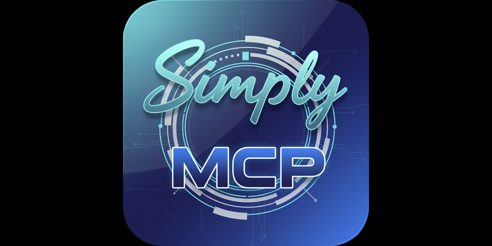

<div align="center">
  
</div>

# Simply MCP

> Type-safe TypeScript framework for building MCP servers with pure interface-driven API - zero boilerplate, full type safety.

[](https://www.npmjs.com/package/simply-mcp)
[](https://opensource.org/licenses/MIT)
[](https://www.typescriptlang.org/)
[](https://nodejs.org/)

## Features

✨ **Pure TypeScript Interfaces**
- Zero boilerplate - just TypeScript interfaces
- Full type safety and IntelliSense
- Compile-time validation
- Clean, intuitive API

📦 **v4.0 Improvements**
- **Slim Package**: 50-60% smaller with optional dependencies
- **File-Based Configuration**: Declare transport and auth in your server interface
- **Built-In Authentication**: API key and OAuth 2.1 authentication
- **MCP Protocol Features**: Full support for server-to-client communication

🚀 **Multiple Transport Support**
- 📡 Stdio (standard input/output)
- 🌐 HTTP with dual modes: Stateful (sessions + SSE, aka Streamable HTTP) and Stateless (serverless)

🔌 **MCP Protocol Features** (v4.0)
- **Sampling**: Request LLM completions from clients
- **Elicitation**: Request user input during tool execution
- **Roots**: Discover client root directories
- **Subscriptions**: Notify clients of resource updates
- **Completions**: Provide autocomplete suggestions
- **Progress Messages**: Provide human-readable status updates during long-running operations (v4.1.0)
- **Tool Annotations**: Metadata hints about tool behavior (read-only, destructive, categories, performance)
- **JSON-RPC 2.0 Batch Processing**: 5x throughput with parallel mode, minimal overhead (1.9%)

🎨 **UI Resources** (v4.0 - Ultra-Minimal Redesign)
- **IUI Interface**: Reduced from 30+ fields to just 6 fields!
- **Auto-Detection**: 6 source types automatically detected (URL, HTML, React, Remote DOM, files, folders)
- **Auto-Extraction**: Dependencies extracted from imports - no manual configuration
- **Zero-Config**: Smart defaults based on NODE_ENV (optional config file for customization)
- **React/JSX Support**: Write UIs in React with full TypeScript support
- **Hot Reload**: Watch mode automatically tracks all relevant files
- **Production Optimizations**: Bundling, minification, CDN via `simply-mcp.config.ts`

🎯 **UI Adapter Layer - React Hooks** (New!)
- **Use ANY component library**: shadcn/ui, Radix UI, Material-UI, Chakra UI, native HTML - all work seamlessly
- **Zero boilerplate**: Reduces 30+ lines of state management to 3 lines
- **useMCPTool hook**: Automatic loading/error/data state management for tool calls
- **Helper utilities**: Aggregate operations for multiple tools (isAnyLoading, hasAnyError, etc.)
- **MCPProvider**: Global configuration and error handling
- **Production-ready**: Request deduplication, retry logic, optimistic updates
- **Type-safe**: Full TypeScript support with automatic type inference
- **No MCP-specific components needed**: Use your favorite UI library as-is

🎵 **Audio Resources** (v4.2)
- **IAudioContent Interface**: Type-safe audio content with base64 encoding
- **IAudioMetadata Interface**: Rich metadata (duration, sample rate, channels, bitrate, codec)
- **createAudioContent() Helper**: Simplify loading audio from files or buffers
- **Multi-Format Support**: MP3, WAV, OGG, FLAC, AAC, M4A, WebM with automatic MIME type detection
- **Static & Dynamic Patterns**: Embedded or runtime-loaded audio resources

## 🎉 v4.0.0: 100% MCP UI Protocol Compliance (Community Extension)

Simply-MCP v4.0.0 achieves **100% compliance** with the [MCP UI specification](https://github.com/idosal/mcp-ui), a community-maintained extension to the official MCP protocol.

> **Note:** MCP-UI is a community extension by [@idosal](https://github.com/idosal), not part of the official Anthropic MCP specification. It extends the protocol to support interactive web UIs alongside traditional tools and resources.

✅ **5/5 Action Types** | ✅ **2/2 Core MIME Types** | ✅ **Official Protocol Format** | ✅ **SDK API Compatibility**

### Resources

- 📘 [MCP UI Protocol Reference](./docs/guides/MCP_UI_PROTOCOL.md)
- 📘 [MCP UI Migration Guide](./docs/guides/MCP_UI_MIGRATION.md)
- 📘 [MCP UI Adapter Hooks Guide](./docs/guides/MCP_UI_ADAPTER_HOOKS.md) ⭐ **NEW**
- 📘 [Remote DOM Advanced Patterns](./docs/guides/REMOTE_DOM_ADVANCED.md)
- 🔧 [Remote DOM Troubleshooting](./docs/guides/REMOTE_DOM_TROUBLESHOOTING.md)
- 🔗 [Official MCP-UI Spec](https://github.com/idosal/mcp-ui)

---

## Architecture: Built on the Official MCP SDK

Simply-MCP is a **developer experience layer** built on top of the official [Anthropic MCP TypeScript SDK](https://github.com/modelcontextprotocol/typescript-sdk). We don't reimplement the protocol - we make it easier to use.

### What the MCP SDK Provides

The official SDK implements the Model Context Protocol specification:
- Protocol message handling (tools, resources, prompts, sampling)
- Transport layers (stdio, HTTP/SSE)
- OAuth 2.1 authentication primitives
- Type definitions and validation

### What Simply-MCP Adds

Simply-MCP builds **on top of** the SDK to provide:

```
┌─────────────────────────────────────────────────────┐
│  Simply-MCP (Developer Experience Layer)            │
├─────────────────────────────────────────────────────┤
│  • Interface-Driven API (zero boilerplate)          │
│  • AST-based metadata extraction                    │
│  • Tool routers & namespaces                        │
│  • CLI tooling (run, bundle, watch)                 │
│  • UI resource helpers (React/JSX compilation)      │
│  • UI adapter layer (React hooks for any library)   │
│  • OAuth storage adapters (InMemoryStorage, Redis)  │
│  • Batch processing context                         │
├─────────────────────────────────────────────────────┤
│  Official MCP SDK (Protocol Foundation)             │
├─────────────────────────────────────────────────────┤
│  • MCP protocol implementation                      │
│  • Transport layers (stdio, HTTP/SSE)               │
│  • OAuth 2.1 primitives                             │
│  • Message schemas & validation                     │
└─────────────────────────────────────────────────────┘
```

**When to use Simply-MCP:**
- ✅ You want interface-driven API (zero boilerplate)
- ✅ You need tool routing/namespacing
- ✅ You're building UI resources
- ✅ You prefer TypeScript-first development

**When to use the SDK directly:**
- ✅ You need maximum control over the protocol
- ✅ Minimal dependencies are critical
- ✅ You're implementing a custom transport layer
- ✅ You're working in a non-TypeScript environment

See [SDK Documentation](https://github.com/modelcontextprotocol/typescript-sdk) for the official protocol reference.

---

## Quick Start

### Installation

```bash
npm install simply-mcp
```

**Optional Dependencies:** Simply-MCP uses lazy loading for advanced features. Dependencies are only required when you use them:
- HTTP transport → `express`, `cors`
- Watch mode → `chokidar`
- Bundling → `esbuild`
- Minification → `terser`, `html-minifier-terser`, `cssnano`
- Client rendering → `@remote-dom/core`, `@remote-dom/react`, `react`, `react-dom`

### Create Your First Server

```typescript
// server.ts
import type { ITool, IParam, IServer } from 'simply-mcp';

// 1. Configure your server
const server: IServer = {
  name: 'my-server',
  version: '1.0.0',
  description: 'A helpful MCP server'
};

// 2. Define parameter interface
interface NameParam extends IParam {
  type: 'string';
  description: 'Person name to greet';
}

// 3. Define your tool interface
interface GreetTool extends ITool {
  name: 'greet';
  description: 'Greet someone';
  params: { name: NameParam };
  result: string;
}

// 4. Implement the server
export default class Server {
  greet: GreetTool = async (params) => `Hello, ${params.name}!`;
}
```

### Run Your Server

```bash
npx simply-mcp run server.ts
```

That's it! Your MCP server is running with full type safety and zero boilerplate.

**Next Steps:**
- 📘 [Quick Start Guide](./docs/guides/QUICK_START.md) - Detailed tutorial
- 📘 [Features Guide](./docs/guides/FEATURES.md) - Tools, prompts, resources
- 📘 [API Reference](./docs/guides/API_REFERENCE.md) - Complete API documentation

---

## Validation

Simply MCP validates your interface definitions during dry-run:

```bash
npx simply-mcp run server.ts --dry-run
```

**Key validation rules:**
- Always use separate `IParam` interfaces (no inline types)
- Automatic type coercion for number/boolean parameters
- Dry-run catches configuration errors early

**Learn More:** [Validation Guide](./docs/guides/VALIDATION.md)

---

## Implementation Requirements

| Feature | Implementation Required? |
|---------|-------------------------|
| **Tools** | ✅ Always |
| **Prompts** | ✅ Always |
| **Static Resources** | ❌ No (framework handles) |
| **Dynamic Resources** | ✅ Required |

**Learn More:** [Features Guide](./docs/guides/FEATURES.md)

---

## Transport & Authentication

### HTTP Transport

```typescript
interface MyServer extends IServer {
  name: 'my-server';
  description: 'My MCP server';
  transport: 'http';
  port: 3000;
}
```

### Authentication

Simply-MCP supports two authentication methods:

#### API Key Authentication

Simple key-based authentication for internal tools:

```typescript
import type { IApiKeyAuth } from 'simply-mcp';

interface MyAuth extends IApiKeyAuth {
  type: 'apiKey';
  keys: [
    { name: 'admin', key: process.env.API_KEY!, permissions: ['*'] }
  ];
}

interface MyServer extends IServer {
  name: 'secure-server';
  description: 'A secure MCP server';
  transport: 'http';
  port: 3000;
  auth: MyAuth;
}
```

#### OAuth 2.1 Authentication

Industry-standard OAuth for production use:

```typescript
import type { IOAuth2Auth } from 'simply-mcp';

interface MyOAuth extends IOAuth2Auth {
  type: 'oauth2';
  issuerUrl: 'https://auth.example.com';
  clients: [
    {
      clientId: 'web-app';
      clientSecret: process.env.OAUTH_CLIENT_SECRET!;
      redirectUris: ['https://app.example.com/callback'];
      scopes: ['read', 'tools:execute'];
      name: 'Web Application';
    }
  ];
}

interface MyServer extends IServer {
  name: 'oauth-server';
  description: 'OAuth-protected MCP server';
  transport: 'http';
  port: 3000;
  stateful: true;  // Required for OAuth
  auth: MyOAuth;
}
```

**Features:**
- Authorization Code + PKCE Flow
- Scope-based access control
- Token refresh and revocation
- Audit logging
- MCP SDK integration

**Learn More:**
- [OAuth 2.1 Guide](./docs/guides/OAUTH2.md) - Complete OAuth documentation
- [OAuth Migration Guide](./docs/guides/OAUTH_MIGRATION.md) - Migrate from API keys
- [Transport Guide](./docs/guides/TRANSPORT.md) - Stdio, HTTP stateful/stateless
- [API Reference](./docs/guides/API_REFERENCE.md) - Authentication details

---

## UI Adapter Layer - React Hooks

**Build UIs with ANY React component library - zero boilerplate!**

The UI Adapter Layer provides React hooks that eliminate boilerplate when calling MCP tools from React components. Use shadcn/ui, Radix UI, Material-UI, Chakra UI, or native HTML - all work seamlessly.

### Quick Example

```typescript
// server.ts - Define your UI with tools whitelist
interface SearchUI extends IUI {
  uri: 'ui://search';
  name: 'Product Search';
  tools: ['search_products', 'add_to_cart']; // ✅ Security whitelist
  source: './SearchComponent.tsx';
}

// SearchComponent.tsx - Use ANY component library!
import { useMCPTool } from 'simply-mcp/client';
import { Button } from '@/components/ui/button'; // shadcn, Radix, MUI, etc.

export default function SearchComponent() {
  const search = useMCPTool('search_products', {
    onSuccess: (data) => console.log('Found:', data)
  });

  return (
    <Button
      onClick={() => search.execute({ query: 'laptop' })}
      disabled={search.loading}
    >
      {search.loading ? 'Searching...' : 'Search'}
    </Button>
  );
}
```

**That's it!** 90% less code compared to manual state management.

### Available Hooks

**100% MCP UI Protocol Coverage** - All 5 official protocol actions have React hooks:

1. **Tool Calls** (complex, stateful)
   - **`useMCPTool`** - Call multiple times for multiple tools (standard React pattern)
   - **Helper utilities** - `isAnyLoading`, `hasAnyError`, `getAllErrors`, `resetAllTools` work with arrays
   - **`MCPProvider`** - Global configuration and error handling

2. **Prompt Submission** - **`usePromptSubmit`** with history tracking and duplicate prevention
3. **Intent Triggers** - **`useIntent`** with debouncing and history tracking
4. **Notifications** - **`useNotify`** with convenience methods (info, success, warning, error)
5. **Link Opening** - **`useOpenLink`** with URL validation, HTTPS-only mode, and domain whitelisting

**When to use hooks vs window API:**
- **Use hooks** for tool calls (complex, need state management) or when you need callbacks, history, or advanced features
- **Use window API** for simple fire-and-forget actions: `window.submitPrompt()`, `window.triggerIntent()`, `window.notify()`, `window.openLink()`

**Learn More:**
- 📘 [MCP UI Adapter Hooks Guide](./docs/guides/MCP_UI_ADAPTER_HOOKS.md) - Complete API documentation for all hooks
- 📘 [MCP UI Protocol Reference](./docs/guides/MCP_UI_PROTOCOL.md) - Official protocol specification
- 📘 [MCP UI Compliance Verification](./MCP_UI_COMPLIANCE_VERIFICATION.md) - 100% protocol compliance checklist
- 💡 [Examples](./examples/ui-with-hooks/) - Working examples with shadcn-style components
  - [SearchExample.tsx](./examples/ui-with-hooks/SearchExample.tsx) - Product search with useMCPTool
  - [DashboardExample.tsx](./examples/ui-with-hooks/DashboardExample.tsx) - Multi-tool dashboard with helper utilities
  - [OptimisticUpdateExample.tsx](./examples/ui-with-hooks/OptimisticUpdateExample.tsx) - React Query-style optimistic updates
  - [CompleteMCPUIExample.tsx](./examples/ui-with-hooks/CompleteMCPUIExample.tsx) - All 5 protocol actions in one example

---

## Tool Routers

Group related tools together and control their visibility in the tools list. Routers reduce context clutter by hiding tools until needed.

### Interface API Example

```typescript
import type { IServer, ITool, IToolRouter } from 'simply-mcp';

// Define your tools
interface GetWeatherTool extends ITool {
  name: 'get_weather';
  description: 'Get current weather';
  params: { location: LocationParam };
  result: { temperature: number; conditions: string };
}

interface GetForecastTool extends ITool {
  name: 'get_forecast';
  description: 'Get weather forecast';
  params: { location: LocationParam; days: DaysParam };
  result: { forecast: Array<DayForecast> };
}

// Create a router - NO implementation needed!
interface WeatherRouter extends IToolRouter {
  name: 'weather_router';  // Optional - inferred from property name
  description: 'Weather information tools';
  tools: [GetWeatherTool, GetForecastTool];  // Reference interfaces directly
}

// Server configuration
interface MyServer extends IServer {
  name: 'my-server';
  description: 'Server with router';
  flattenRouters: false;  // Hide router tools from main list (recommended)
}

// Implementation
export default class MyServer implements MyServer {
  // Implement the tools
  getWeather: GetWeatherTool = async (params) => ({
    temperature: 72,
    conditions: 'Sunny'
  });

  getForecast: GetForecastTool = async (params) => ({
    forecast: [/* forecast data */]
  });

  // Router requires NO implementation - just declare it!
  weatherRouter!: WeatherRouter;
}
```

### How It Works

**When `flattenRouters: false` (recommended):**
1. Main `tools/list` shows ONLY `weather_router`, not the individual tools
2. Call `weather_router` to get the list of weather tools with descriptions
3. Call individual tools via namespace: `weather_router__get_weather`

**When `flattenRouters: true`:**
- All tools appear in the main list (router + individual tools)
- Useful for development/testing

**Benefits:**
- **Reduce context clutter:** Hide large tool sets until needed
- **Logical grouping:** Organize related tools together
- **Discovery:** Clients can explore tools by calling routers
- **Zero implementation:** Just declare the router interface

**Learn More:** [Router Tools Guide](./docs/guides/ROUTER_TOOLS.md)

---

## Batch Processing (Quick Example)

Process multiple requests efficiently with JSON-RPC 2.0 batch support for 5x throughput improvement.

### Configuration

```typescript
import { BuildMCPServer } from 'simply-mcp';
import { z } from 'zod';

const server = new BuildMCPServer({
  name: 'batch-server',
  version: '1.0.0',
  batching: {
    enabled: true,
    parallel: true,      // 5x faster throughput (940 vs 192 req/sec)
    maxBatchSize: 100    // DoS protection
  }
});
```

### Batch-Aware Tool

```typescript
server.addTool({
  name: 'export_record',
  description: 'Export a record with batch awareness',
  parameters: z.object({
    record_id: z.string()
  }),
  execute: async (params, context) => {
    // Access batch context
    if (context?.batch) {
      const { index, size, parallel } = context.batch;
      console.log(`Processing ${index + 1}/${size} (parallel: ${parallel})`);

      // First request - initialize resources
      if (index === 0) {
        initializeResourcePool();
      }

      // Last request - cleanup
      if (index === size - 1) {
        cleanupResourcePool();
      }
    }

    // Export logic here
    return {
      content: [{
        type: 'text',
        text: `Record ${params.record_id} exported`
      }]
    };
  }
});
```

### Client Usage

```javascript
// Send batch request (JSON-RPC 2.0 format)
const batchRequest = [
  {"jsonrpc":"2.0","id":1,"method":"tools/call","params":{"name":"export_record","arguments":{"record_id":"A"}}},
  {"jsonrpc":"2.0","id":2,"method":"tools/call","params":{"name":"export_record","arguments":{"record_id":"B"}}},
  {"jsonrpc":"2.0","id":3,"method":"tools/call","params":{"name":"export_record","arguments":{"record_id":"C"}}}
];

// Receive all responses together
// Parallel mode: 5x faster than individual requests
// Minimal overhead: 1.9%
```

### Performance

**Throughput:**
- Sequential mode: 192 requests/second
- Parallel mode: 940 requests/second (5x improvement)

**Batch vs Individual:**
- 10 individual requests: ~513ms
- 1 batch of 10 (parallel): ~53ms
- Speedup: 9.68x with batching

**Overhead:** 1.9% (minimal)

**See Complete Example:** [examples/interface-batch-requests.ts](./examples/interface-batch-requests.ts)

**Learn More:**
- [API Reference - Batch Processing](./docs/guides/API_REFERENCE.md#batch-processing-configuration)
- [Features Guide - Batch Processing](./docs/guides/FEATURES.md#batch-processing)
- [Protocol Guide - JSON-RPC Batch](./docs/guides/PROTOCOL.md#json-rpc-20-batch-requests)

---

## Why Interface API?

**Zero Boilerplate:** No manual schema definitions or decorator setup
**Full Type Safety:** Compile-time type checking with complete IntelliSense
**Clean Code:** Pure interface definitions with no runtime overhead

---

## Documentation

### Getting Started
- [Quick Start](./docs/guides/QUICK_START.md) - Get started in 5 minutes
- [Features Guide](./docs/guides/FEATURES.md) - Tools, prompts, resources
- [API Reference](./docs/guides/API_REFERENCE.md) - Complete API documentation
- [Validation Guide](./docs/guides/VALIDATION.md) - Parameter validation rules

### Advanced Topics
- [Protocol Features](./docs/guides/PROTOCOL.md) - Sampling, elicitation, roots, subscriptions, progress messages
- [Transport Guide](./docs/guides/TRANSPORT.md) - Stdio, HTTP stateful/stateless
- [Configuration Guide](./docs/guides/CONFIGURATION.md) - Environment and runtime options
- [Bundling Guide](./docs/guides/BUNDLING.md) - Production bundling

### UI Resources
- [MCP UI Protocol](./docs/guides/MCP_UI_PROTOCOL.md) - UI protocol reference
- [MCP UI Migration](./docs/guides/MCP_UI_MIGRATION.md) - Upgrade from legacy formats
- [Remote DOM Advanced](./docs/guides/REMOTE_DOM_ADVANCED.md) - Performance & security
- [Remote DOM Troubleshooting](./docs/guides/REMOTE_DOM_TROUBLESHOOTING.md) - Debug guide

---

## Examples

Working examples using the Interface API:

**Basic Examples:**
- **[interface-minimal.ts](./examples/interface-minimal.ts)** - Minimal server with basic tools
- **[interface-advanced.ts](./examples/interface-advanced.ts)** - Advanced features (prompts, resources, validation)
- **[interface-params.ts](./examples/interface-params.ts)** - Parameter validation examples
- **[interface-audio-resource.ts](./examples/interface-audio-resource.ts)** - Audio resources with metadata (MP3, WAV, OGG, FLAC)

**Protocol Features:**
- **[interface-sampling.ts](./examples/interface-sampling.ts)** - LLM sampling integration
- **[interface-elicitation.ts](./examples/interface-elicitation.ts)** - User input requests
- **[interface-roots.ts](./examples/interface-roots.ts)** - Root directory discovery
- **[interface-subscriptions.ts](./examples/interface-subscriptions.ts)** - Resource update notifications
- **[interface-progress-messages.ts](./examples/interface-progress-messages.ts)** - Progress notifications with status messages

**UI Examples:**
- **[interface-file-based-ui.ts](./examples/interface-file-based-ui.ts)** - External HTML/CSS/JS files
- **[interface-react-dashboard.ts](./examples/interface-react-dashboard.ts)** - Full React dashboard
- **[interface-production-optimized.ts](./examples/interface-production-optimized.ts)** - Production-ready

**Transport & Auth:**
- **[interface-http-auth.ts](./examples/interface-http-auth.ts)** - HTTP server with authentication
- **[interface-http-stateless.ts](./examples/interface-http-stateless.ts)** - Serverless-ready HTTP

**See:** [Examples Index](./examples/README.md) for complete list

---

## Testing

```bash
# Run all tests
npm test

# Run unit tests
npm run test:unit

# Run with coverage
npm run test:unit:coverage
```

**CI/CD Pipeline:**
- ✅ Unit tests + Examples validation: **Required** (blocks PRs on failure)
- ⚠️ Integration tests: Informational (non-blocking)

---

## Development

### Getting Started with Development

```bash
# Clone the repo
git clone https://github.com/Clockwork-Innovations/simply-mcp-ts.git
cd simply-mcp-ts

# Install dependencies
npm install

# Build
npm run build

# Run examples
npx simply-mcp run examples/interface-minimal.ts
```

### Development Workflow

```bash
# Watch mode for development
npm run dev

# Test your changes
npm run test:unit
npm run test:examples

# Run full test suite
npm test
```

---

## Contributing

Contributions are welcome! Please read our [Contributing Guide](./.github/CONTRIBUTING.md) for details.

---

## License

MIT © [Nicholas Marinkovich, MD](https://cwinnov.com)

---

## Links

- [NPM Package](https://www.npmjs.com/package/simply-mcp)
- [GitHub Repository](https://github.com/Clockwork-Innovations/simply-mcp-ts)
- [Issue Tracker](https://github.com/Clockwork-Innovations/simply-mcp-ts/issues)
- [Changelog](./CHANGELOG.md)

## Support

- 📖 [Documentation](./docs/guides/QUICK_START.md)
- 💬 [Discussions](https://github.com/Clockwork-Innovations/simply-mcp-ts/discussions)
- 🐛 [Issue Tracker](https://github.com/Clockwork-Innovations/simply-mcp-ts/issues)

## Acknowledgments

Built with the [Model Context Protocol SDK](https://github.com/modelcontextprotocol/sdk) by Anthropic.

---

**Made with ❤️ by the Simply MCP Team**
