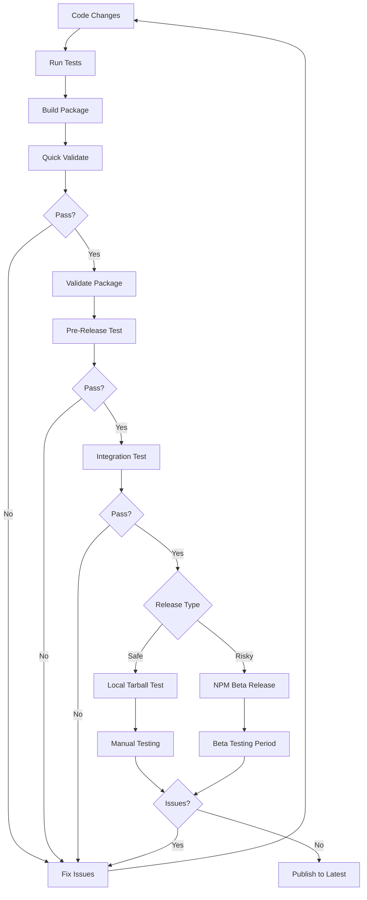

# Beta Release Guide for simply-mcp

**Purpose:** This guide provides step-by-step instructions for testing npm packages before publishing them to production, using beta releases and local tarball testing.

**Version:** 1.0.0
**Last Updated:** 2025-10-06
**Target Audience:** Core maintainers and release engineers

---

## Table of Contents

1. [Overview](#overview)
2. [Pre-Release Validation Process](#pre-release-validation-process)
3. [Testing Strategies](#testing-strategies)
4. [Step-by-Step: Local Tarball Testing](#step-by-step-local-tarball-testing)
5. [Step-by-Step: NPM Beta Release](#step-by-step-npm-beta-release)
6. [Step-by-Step: GitHub Registry Testing](#step-by-step-github-registry-testing)
7. [Validation Checklist](#validation-checklist)
8. [Rollback Procedures](#rollback-procedures)
9. [When to Promote Beta to Stable](#when-to-promote-beta-to-stable)
10. [Troubleshooting](#troubleshooting)
11. [Best Practices](#best-practices)

---

## Overview

### Why Pre-Release Testing?

Publishing a broken package to npm can cause:
- User frustration and lost trust
- Broken CI/CD pipelines for downstream users
- Difficult rollbacks and version management issues
- Support burden from bug reports

**Solution:** Always test packages before publishing to the `latest` tag.

### Testing Philosophy

```
Local Tarball (Fast) → Beta Tag (Realistic) → Latest Tag (Production)
       ↓                      ↓                       ↓
  Quick tests           Full validation         Public release
  Minutes               Hours/Days              Permanent
```

### Available Scripts

We provide four validation scripts:

| Script | Purpose | Duration | When to Use |
|--------|---------|----------|-------------|
| `quick-validate.sh` | Fast smoke test | 1-2 min | During development |
| `validate-package.sh` | Package structure check | 30 sec | Before packing |
| `pre-release-test.sh` | Comprehensive tarball test | 3-5 min | Before beta/release |
| `integration-test.sh` | Full E2E scenarios | 5-10 min | Before stable release |

---

## Pre-Release Validation Process

### High-Level Workflow



### Risk Assessment

**Low Risk Changes** (use local tarball testing):
- Documentation updates
- Minor bug fixes
- Internal refactoring
- Dependency version bumps (patch)

**Medium Risk Changes** (consider beta release):
- New features
- API additions (backward compatible)
- Significant refactoring
- Major dependency updates

**High Risk Changes** (always use beta release):
- Breaking changes
- Major version bumps
- Transport/protocol changes
- Core architecture changes

---

## Testing Strategies

### Strategy 1: Local Tarball Testing ⚡

**Best For:** Low-risk changes, quick iterations

**Pros:**
- ✅ Fast feedback (minutes)
- ✅ No npm registry interaction
- ✅ Test exact package contents
- ✅ Easy to iterate

**Cons:**
- ❌ Not realistic user installation
- ❌ Doesn't test npm registry edge cases
- ❌ Local environment only

**Recommended For:**
- Bug fixes
- Documentation changes
- Internal refactoring
- Quick validation during development

---

### Strategy 2: NPM Beta Tag 🎯

**Best For:** Medium to high-risk changes, pre-release testing

**Pros:**
- ✅ Realistic npm installation
- ✅ Tests registry integration
- ✅ Team can test
- ✅ Can iterate before stable
- ✅ Doesn't affect `latest` tag

**Cons:**
- ❌ Slower (hours/days for testing)
- ❌ Visible to public (though marked beta)
- ❌ Requires version management

**Recommended For:**
- New features
- API changes
- Breaking changes
- Major refactoring
- Before major version releases

---

### Strategy 3: GitHub Registry 🔒

**Best For:** Private team testing, enterprise workflows

**Pros:**
- ✅ Private to organization
- ✅ Realistic registry testing
- ✅ Team collaboration
- ✅ Doesn't pollute npm

**Cons:**
- ❌ Requires GitHub setup
- ❌ Different registry URL
- ❌ Authentication needed
- ❌ Not tested by public

**Recommended For:**
- Enterprise/private packages
- Pre-beta validation
- Team testing before public beta

---

## Step-by-Step: Local Tarball Testing

### Phase 1: Validate and Build

```bash
# 1. Ensure you're on the correct branch
git status
git pull origin main

# 2. Update version in package.json (if needed)
# Edit package.json: "version": "2.5.0"

# 3. Run quick validation
bash scripts/quick-validate.sh

# 4. Validate package structure
bash scripts/validate-package.sh

# 5. Run comprehensive pre-release tests
bash scripts/pre-release-test.sh 2.5.0
```

### Phase 2: Local Testing

The `pre-release-test.sh` script automatically:
- Builds the package
- Creates tarball
- Sets up test environment in `/tmp`
- Installs from tarball
- Runs all validation tests
- Reports results

**What it tests:**
- ✅ Import patterns (old and new)
- ✅ All three API styles
- ✅ CLI commands
- ✅ TypeScript types
- ✅ Package contents
- ✅ Error messages

### Phase 3: Manual Testing (Optional)

If you want to manually test specific scenarios:

```bash
# Create test directory
mkdir -p /tmp/my-test
cd /tmp/my-test

# Initialize project
npm init -y

# Install from tarball
npm install /path/to/simply-mcp-2.5.0.tgz

# Install dev dependencies
npm install --save-dev tsx typescript

# Create test file
cat > test.ts << 'EOF'
import { MCPServer, tool } from 'simply-mcp';

@MCPServer({ name: 'test', version: '1.0.0' })
class TestServer {
  @tool('Test tool')
  async test(): Promise<string> {
    return 'success';
  }
}
export default TestServer;
EOF

# Test it
npx simplymcp-class test.ts --dry-run

# Cleanup
cd -
rm -rf /tmp/my-test
```

### Phase 4: Decision Point

**If all tests pass:**
- ✅ Proceed to release (low-risk changes)
- ✅ Proceed to beta release (high-risk changes)

**If tests fail:**
- ❌ Fix issues
- ❌ Repeat from Phase 1

---

## Step-by-Step: NPM Beta Release

### Prerequisites

```bash
# Ensure you're logged into npm
npm whoami

# If not logged in:
npm login
```

### Phase 1: Prepare Beta Version

```bash
# 1. Create feature branch (if not on one)
git checkout -b release/v2.5.0-beta

# 2. Update version to beta
npm version 2.5.0-beta.1 --no-git-tag-version

# This updates package.json to "version": "2.5.0-beta.1"
```

### Phase 2: Build and Validate

```bash
# 3. Clean and build
npm run clean
npm run build

# 4. Run all validation scripts
bash scripts/validate-package.sh
bash scripts/pre-release-test.sh 2.5.0-beta.1
bash scripts/integration-test.sh
```

### Phase 3: Publish Beta

```bash
# 5. Publish to npm with @beta tag
npm publish --tag beta

# This publishes but does NOT update the "latest" tag
# Users must explicitly install with: npm install simply-mcp@beta
```

**Verify publication:**

```bash
# Check that beta tag points to your version
npm dist-tag ls simply-mcp

# Output should show:
# beta: 2.5.0-beta.1
# latest: 2.4.7  (unchanged)
```

### Phase 4: Beta Testing Period

**Install and test beta:**

```bash
# In a fresh directory
mkdir -p /tmp/beta-test
cd /tmp/beta-test

# Initialize project
npm init -y

# Install beta version
npm install simply-mcp@beta

# Verify correct version
npm list simply-mcp
# Should show: simply-mcp@2.5.0-beta.1

# Test your scenarios
# ... (create test files, run tests)
```

**Test Duration:**
- **Minor changes:** 1-2 hours of testing
- **Major features:** 1-2 days of testing
- **Breaking changes:** 3-7 days of testing

**What to test:**
- ✅ Fresh installation
- ✅ Upgrade from previous version
- ✅ All examples
- ✅ Real-world use cases
- ✅ Edge cases
- ✅ Performance
- ✅ Documentation accuracy

### Phase 5: Iterate if Needed

**If issues found:**

```bash
# 1. Fix issues in code
# ... make changes ...

# 2. Increment beta version
npm version 2.5.0-beta.2 --no-git-tag-version

# 3. Rebuild and test
npm run build
bash scripts/pre-release-test.sh

# 4. Publish new beta
npm publish --tag beta

# 5. Test again
npm install simply-mcp@beta  # Gets beta.2
```

**Iterate as many times as needed:**
- `2.5.0-beta.1` → found issue
- `2.5.0-beta.2` → found another issue
- `2.5.0-beta.3` → looks good!

### Phase 6: Promote Beta to Stable

**When beta is validated:**

```bash
# 1. Update version to stable
npm version 2.5.0 --no-git-tag-version

# 2. Final validation
npm run clean
npm run build
bash scripts/pre-release-test.sh 2.5.0
bash scripts/integration-test.sh

# 3. Publish to latest tag
npm publish

# This updates the "latest" tag

# 4. Verify
npm dist-tag ls simply-mcp
# Output:
# beta: 2.5.0-beta.3  (stays on last beta)
# latest: 2.5.0        (updated!)
```

### Phase 7: Git Tagging and Release

```bash
# 5. Commit version change
git add package.json
git commit -m "chore(release): v2.5.0"

# 6. Create git tag
git tag -a v2.5.0 -m "Release v2.5.0"

# 7. Push to GitHub
git push origin main
git push origin v2.5.0

# 8. Create GitHub release (optional)
gh release create v2.5.0 \
  --title "v2.5.0 - UX Improvements" \
  --notes-file docs/releases/RELEASE_NOTES_v2.5.0.md
```

---

## Step-by-Step: GitHub Registry Testing

### Prerequisites

```bash
# 1. Create .npmrc file in project root
cat > .npmrc << 'EOF'
@your-org:registry=https://npm.pkg.github.com
EOF

# 2. Create GitHub token with write:packages scope
# Go to: https://github.com/settings/tokens
# Create token with "write:packages" permission

# 3. Login to GitHub registry
npm login --registry=https://npm.pkg.github.com
# Username: your-github-username
# Password: <paste your token>
# Email: your-email@example.com
```

### Publishing to GitHub Registry

```bash
# 1. Update package.json with scope
# Change: "name": "simply-mcp"
# To:     "name": "@your-org/simply-mcp"

# 2. Add repository field (if not present)
# "repository": {
#   "type": "git",
#   "url": "https://github.com/your-org/simply-mcp"
# }

# 3. Build and validate
npm run build
bash scripts/pre-release-test.sh

# 4. Publish to GitHub registry
npm publish --registry=https://npm.pkg.github.com

# 5. Team members can test with:
npm install @your-org/simply-mcp --registry=https://npm.pkg.github.com
```

### Transitioning to Public NPM

```bash
# 1. Revert package.json name
# Change: "@your-org/simply-mcp"
# Back to: "simply-mcp"

# 2. Publish to npm
npm publish --registry=https://registry.npmjs.org
```

---

## Validation Checklist

Use this checklist before promoting to stable:

### Build & Tests
- [ ] `npm run clean` succeeds
- [ ] `npm run build` succeeds without errors or warnings
- [ ] `npm test` passes all tests
- [ ] No TypeScript errors (`tsc --noEmit`)

### Package Validation
- [ ] `bash scripts/validate-package.sh` passes
- [ ] Package size is reasonable (check with `du -sh dist/`)
- [ ] No sensitive files included (`.env`, `.git`, etc.)
- [ ] README.md is accurate and up-to-date
- [ ] LICENSE file is present
- [ ] CHANGELOG or release notes updated

### Installation Tests
- [ ] `bash scripts/quick-validate.sh` passes
- [ ] `bash scripts/pre-release-test.sh` passes
- [ ] `bash scripts/integration-test.sh` passes
- [ ] Fresh installation works
- [ ] Upgrade from previous version works

### Import Tests
- [ ] Old import pattern works: `from 'simply-mcp/decorators'`
- [ ] New import pattern works: `from 'simply-mcp'`
- [ ] Mixed imports work
- [ ] TypeScript types are correct
- [ ] Deprecation warnings show in IDE

### API Tests
- [ ] Decorator API works (class-based)
- [ ] Programmatic API works
- [ ] Functional API works
- [ ] All decorators work: `@MCPServer`, `@tool`, `@prompt`, `@resource`

### CLI Tests
- [ ] `simply-mcp --version` works
- [ ] `simplymcp --help` works
- [ ] `simplymcp-run` works
- [ ] `simplymcp-class` works
- [ ] `simplymcp-func` works
- [ ] `simplymcp-bundle` works
- [ ] Auto-detection works correctly

### Transport Tests
- [ ] Stdio transport works
- [ ] HTTP transport works
- [ ] Stateful HTTP works
- [ ] Stateless HTTP works

### Example Tests
- [ ] All example files run successfully
- [ ] `examples/class-minimal.ts` works
- [ ] `examples/class-basic.ts` works
- [ ] `examples/simple-server.ts` works
- [ ] Examples in documentation work

### Error Message Tests
- [ ] Error messages are helpful
- [ ] Missing decorator errors are clear
- [ ] Invalid parameter errors are clear
- [ ] File not found errors are clear

### Documentation Tests
- [ ] README.md examples work
- [ ] Quick start guide is accurate
- [ ] API documentation is complete
- [ ] Migration guide is accurate
- [ ] Examples match code

### Performance Tests
- [ ] Package size hasn't increased unexpectedly
- [ ] Import time is reasonable
- [ ] CLI startup time is acceptable
- [ ] No memory leaks

### Security Tests
- [ ] `npm audit` shows no vulnerabilities
- [ ] Dependencies are up-to-date
- [ ] No malicious code
- [ ] No exposed secrets

### Final Checks
- [ ] All beta testers approve
- [ ] No open critical issues
- [ ] Release notes are complete
- [ ] Migration guide is ready
- [ ] Rollback plan is documented

---

## Rollback Procedures

### If Issues Found During Beta

**Option 1: Fix and Iterate**
```bash
# Fix the issue, increment beta version
npm version 2.5.0-beta.2 --no-git-tag-version
npm run build
npm publish --tag beta
```

**Option 2: Deprecate Beta**
```bash
# Mark beta as deprecated
npm deprecate simply-mcp@2.5.0-beta.1 "This beta has issues, use beta.2"

# Publish fixed version
npm version 2.5.0-beta.2 --no-git-tag-version
npm publish --tag beta
```

### If Issues Found After Stable Release

**Critical Issues (within hours of release):**

```bash
# 1. Deprecate the broken version
npm deprecate simply-mcp@2.5.0 "Critical issue found, use 2.4.7 until 2.5.1 is released"

# 2. Point latest back to previous stable
npm dist-tag add simply-mcp@2.4.7 latest

# 3. Fix issues and release patch
npm version 2.5.1 --no-git-tag-version
npm run build
bash scripts/pre-release-test.sh
npm publish

# 4. Update latest to fixed version
npm dist-tag add simply-mcp@2.5.1 latest
```

**Minor Issues (can wait for patch):**

```bash
# 1. Create issue on GitHub
gh issue create --title "Bug in v2.5.0" --body "..."

# 2. Fix in patch release
npm version 2.5.1 --no-git-tag-version
# ... fix code ...
npm publish
```

### If Beta Never Stabilizes

```bash
# Just don't promote beta to latest
# Let beta.X versions stay on beta tag

# Eventually:
npm unpublish simply-mcp@2.5.0-beta.1 --force  # (within 72 hours only)
# Or just leave it - beta versions are expected to be unstable
```

---

## When to Promote Beta to Stable

### Criteria for Promotion

**All must be true:**
- ✅ All validation scripts pass
- ✅ Beta testing period completed (1-7 days depending on risk)
- ✅ No critical issues reported
- ✅ All test scenarios pass
- ✅ Documentation is accurate
- ✅ Team approval obtained
- ✅ No open blocking issues
- ✅ Performance is acceptable

### Risk-Based Testing Periods

| Change Type | Beta Period | Scenarios to Test |
|-------------|-------------|-------------------|
| **Patch (2.5.0 → 2.5.1)** | 1-2 hours | Quick smoke tests |
| **Minor (2.5.0 → 2.6.0)** | 1-2 days | New features + regression |
| **Major (2.0.0 → 3.0.0)** | 3-7 days | Everything + migration |
| **Breaking Changes** | 7+ days | Everything + community feedback |

### Promotion Process

```bash
# 1. Verify beta is stable
npm install simply-mcp@beta
# ... test thoroughly ...

# 2. Update version to stable
npm version 2.5.0 --no-git-tag-version

# 3. Final validation
npm run clean
npm run build
bash scripts/pre-release-test.sh 2.5.0
bash scripts/integration-test.sh

# 4. Publish
npm publish

# 5. Verify
npm info simply-mcp version  # Should show 2.5.0
npm dist-tag ls simply-mcp

# 6. Create git tag
git tag v2.5.0
git push origin main --tags

# 7. Create GitHub release
gh release create v2.5.0 --notes-file docs/releases/RELEASE_NOTES_v2.5.0.md

# 8. Announce release
# - Update README.md badge
# - Post to social media / blog
# - Notify users
```

---

## Troubleshooting

### "npm publish" fails with 403

```bash
# Check if logged in
npm whoami

# If not logged in
npm login

# Check access rights
npm access ls-packages

# Check if package name is taken
npm info simply-mcp
```

### Tarball installation fails

```bash
# Check tarball exists
ls -lh *.tgz

# Check tarball contents
tar -tzf simply-mcp-2.5.0.tgz | head -n 20

# Try manual installation
npm install ./simply-mcp-2.5.0.tgz --verbose
```

### Tests fail in `/tmp` but work locally

```bash
# Check environment variables
echo $NODE_ENV
echo $PATH

# Check node/npm versions
node --version
npm --version

# Check disk space
df -h /tmp

# Try with verbose logging
bash scripts/pre-release-test.sh 2>&1 | tee test.log
```

### Beta tag doesn't update

```bash
# Check current tags
npm dist-tag ls simply-mcp

# Manually set beta tag
npm dist-tag add simply-mcp@2.5.0-beta.2 beta

# Verify
npm dist-tag ls simply-mcp
```

### Version conflicts

```bash
# Check current version
npm info simply-mcp version

# Check all versions
npm view simply-mcp versions

# If version exists, increment
npm version 2.5.0-beta.2 --no-git-tag-version
```

---

## Best Practices

### Do's ✅

1. **Always test locally first** - Use tarball testing before beta
2. **Use beta for risky changes** - New features, breaking changes
3. **Increment beta versions** - Don't republish same beta version
4. **Run all validation scripts** - Don't skip steps
5. **Wait appropriate time** - Let beta bake based on risk
6. **Test upgrade paths** - Not just fresh installs
7. **Test all examples** - Ensure documentation matches code
8. **Get team approval** - Don't publish alone for major changes
9. **Document everything** - Update CHANGELOG and release notes
10. **Have rollback plan** - Know how to recover from issues

### Don'ts ❌

1. **Don't skip testing** - Even for "small" changes
2. **Don't publish directly to latest** - Use beta first for risky changes
3. **Don't rush beta period** - Let it run full duration
4. **Don't ignore warnings** - Validation warnings indicate issues
5. **Don't test only happy paths** - Test edge cases and errors
6. **Don't forget TypeScript types** - Test type checking
7. **Don't publish late Friday** - Hard to fix issues over weekend
8. **Don't publish without backup** - Have rollback plan ready
9. **Don't skip documentation** - Update docs with code
10. **Don't ignore community feedback** - Listen to beta testers

### Version Numbering Best Practices

```bash
# Patch releases (bug fixes)
2.5.0 → 2.5.1
# No beta needed for small fixes

# Minor releases (new features)
2.5.0 → 2.6.0-beta.1 → 2.6.0-beta.2 → 2.6.0
# Use beta for 1-2 days

# Major releases (breaking changes)
2.5.0 → 3.0.0-beta.1 → 3.0.0-beta.2 → 3.0.0-rc.1 → 3.0.0
# Use beta for 1-2 weeks, rc for final testing

# Pre-release tags
-beta.1, -beta.2   # Active development
-rc.1, -rc.2       # Release candidate (near stable)
-alpha.1           # Very unstable (rarely used)
```

---

## Quick Reference

### One-Liner Commands

```bash
# Quick validation
npm run build && bash scripts/quick-validate.sh

# Full validation
npm run clean && npm run build && bash scripts/pre-release-test.sh

# Publish beta
npm version 2.5.0-beta.1 --no-git-tag-version && npm publish --tag beta

# Publish stable
npm version 2.5.0 --no-git-tag-version && npm publish

# Rollback latest tag
npm dist-tag add simply-mcp@2.4.7 latest

# Check what users will install
npm info simply-mcp version
npm dist-tag ls simply-mcp
```

### File Locations

- **Validation Scripts:** `/scripts/`
  - `quick-validate.sh` - Fast smoke test
  - `validate-package.sh` - Package structure
  - `pre-release-test.sh` - Comprehensive test
  - `integration-test.sh` - E2E scenarios

- **Documentation:** `/docs/`
  - `releases/RELEASE_NOTES_v*.md` - Release notes
  - `migration/` - Migration guides
  - `development/` - Development guides

---

## Conclusion

Pre-release testing is critical for maintaining package quality and user trust. By following this guide and using the provided validation scripts, you can confidently release updates to simply-mcp without breaking existing users.

**Remember:**
- ⚡ Use **local tarball** testing for quick, low-risk changes
- 🎯 Use **npm beta** releases for medium to high-risk changes
- 🔒 Use **GitHub registry** for private pre-beta testing
- ✅ Always run all validation scripts before publishing
- 📋 Use the checklist to ensure nothing is missed
- 🛡️ Have a rollback plan ready

**When in doubt, use a beta release.** It's better to catch issues before they affect users on the `latest` tag.

---

## Additional Resources

- [NPM Documentation: dist-tag](https://docs.npmjs.com/cli/v9/commands/npm-dist-tag)
- [Semantic Versioning](https://semver.org/)
- [NPM Package Lifecycle](https://docs.npmjs.com/cli/v9/using-npm/scripts#life-cycle-scripts)
- [NPM Deprecate Command](https://docs.npmjs.com/cli/v9/commands/npm-deprecate)
- [GitHub Packages Documentation](https://docs.github.com/en/packages)

---

**Document Version:** 1.0.0
**Last Updated:** 2025-10-06
**Maintained By:** simply-mcp core team
